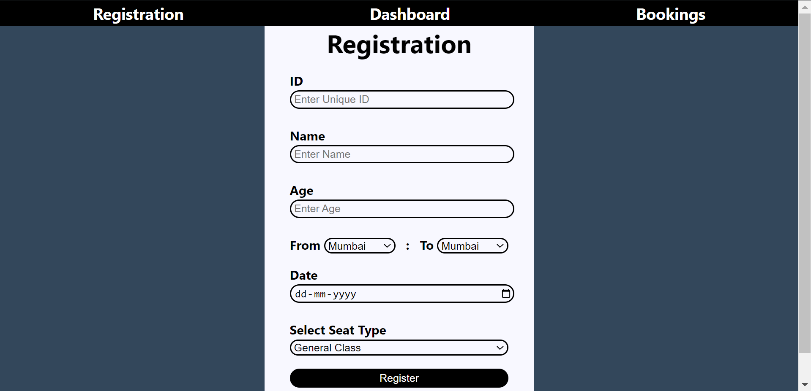
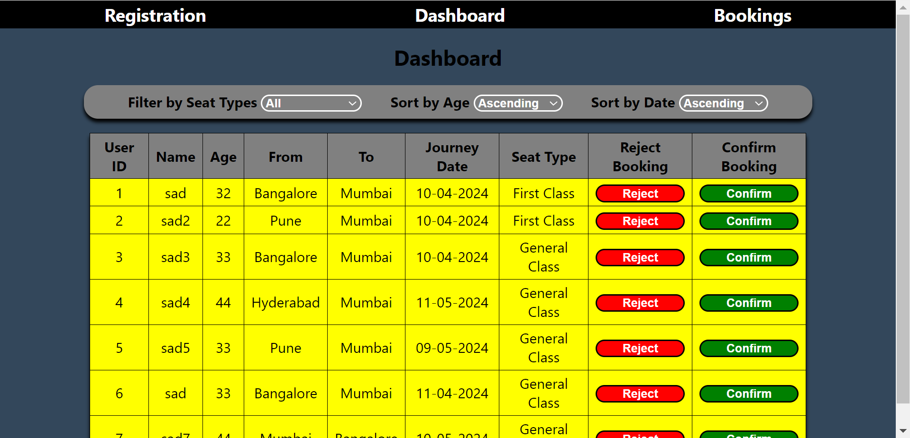
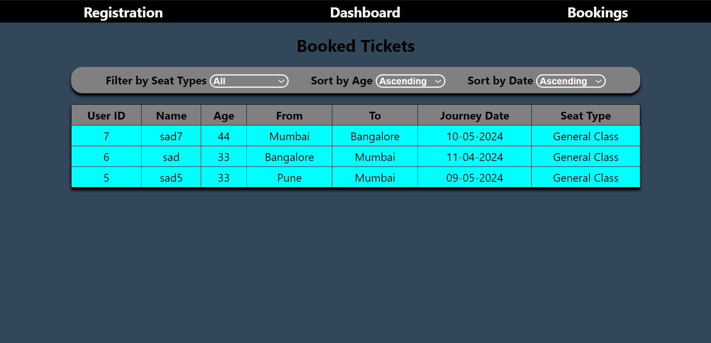

# 🚂Train Ticket Booking System🛤️

## Description

This is a simple **Train Ticket Booking System** web application developed using `HTML`, `CSS`, and `JavaScript`. The application allows user to **Register**, **Book** and **View** their booked tickets, and also _cancel_ or _confirm_ their bookings. Here we have used **LocalStorage** as a database.

## Features

- **User Registration**: _User_ can register by filling the form.
- **Authentication**: To submit form user must pass all the authentications.
- **Train Booking**: _Admin_ can either **Book** or **Cancel** a train ticket for any user. _Admin_ require **OTP** to book tickets.
- Lastly, user can view their booked tickets in the **Booking** section.
- Also, you can **sort** and **filter** tickets according to your needs on both **Dashboard** and **Booked Ticket** page.

## Usage

1. **Registration Page**: Fill up the required fields and click on "**Submit**" button, while submitting **OTP** will generate so please note that.
2. **Dashboard Page**: Nevigate to **Dashboard** Click on `Confirm` button and enter the **OTP** to add ticket into waiting list. After some time your ticket will get booked.
3. **Bookings Page**: You can see your booked ticket on **Bookings** page.

<b>⚠️Important Note & Warning⚠️</b>

<i>Once you see and use this project, then please don't forget to clear your **LocalStorage** by clicking on the `button`, it is located below "**submit**" `button` on **registration** page.

[`Read more on MDN Docs`](https://developer.mozilla.org/en-US/docs/Web/API/Window/localStorage)
</i>

## Pages

1. `index`: User registration page.
2. `dashboard`: Dashboard page for managing tickets.
3. `booking`: Dashboard page for showing booked tickets.

## Installation and Usage Instructions

1. Clone the repository: `git clone https://github.com/SAD0XER/Book-Train-Ticket.git`.
2. Navigate to the project directory / folder `Book-Train-Ticket`.
3. Copy the file path of `index.html` file and open it in your browser to access the user registration page.

## Screenshots

1. **Registration Page**:

2. **Dashboard Page**:

3. **Bookings Page**:

## Technologies Used🧑‍💻

- **Frontend**: `HTML`, `CSS` and `JavaScript`
- **Backend**: `JavaScript`
- **Database**: `LocalStorage` (**P.S**: _We have use localStorage as a database for storing data temporarily._)

## Acknowledgments🤗

Special thanks to [**Arbaz Hussain**](https://github.com/Arbaz86) for his help.
